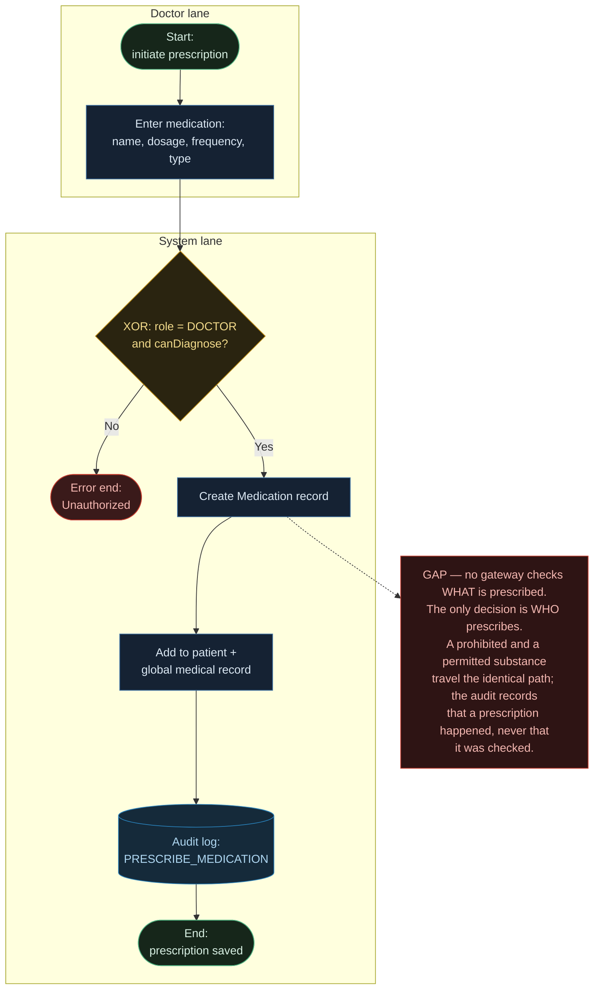
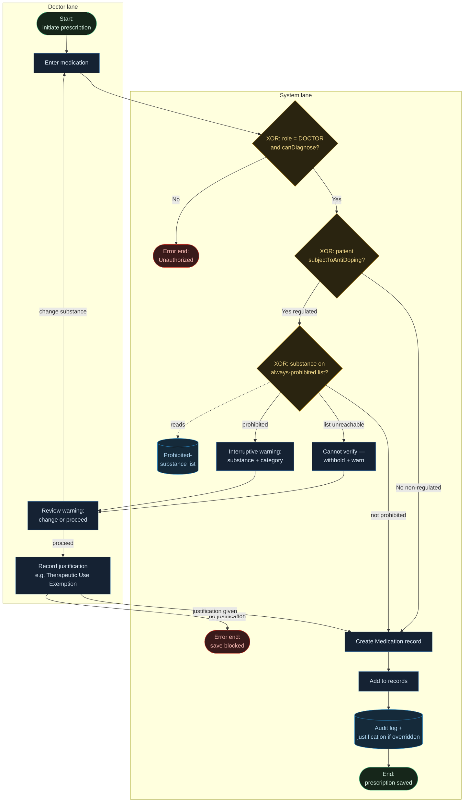

# Process Maps — AxisMed Elite Prescribing Flow

AS-IS and TO-BE maps for the prescribing flow, the difference between them, and the gap analysis that turns that difference into a backlog. The subject is the v1 anti-doping safeguard specified in `prd-antidoping.md`; these maps show where it inserts and what it changes.

**Scope of these maps.** One pool — the clinic — with two lanes, Doctor and System. In v1 the prohibited-substance check runs in-process inside `prescribeMedication()`, so the System is a lane, not a separate participant, and every arrow is a sequence flow. (v3 sources the list from an external service; at that point the list becomes a separate pool reached by a message flow. That is noted, not drawn, so this file depicts one notation.)

**Notation (BPMN, recognition level).** Circle = event (start / end / error end). Rounded rectangle = task. Diamond = exclusive (XOR) gateway — exactly one path taken. Cylinder = data store (read or written). Solid arrow = sequence flow. Dashed arrow = a gateway reading from a data store. Red note = text annotation, attached by association — commentary, not a step.

---

## AS-IS — current prescribing flow

Grounded in `ClinicService.prescribeMedication()` as it exists today.

The single diamond is about the **actor**, never the **substance**. That linearity — the missing gate between "enter" and "save" — is the gap, drawn.

---

## TO-BE — v1 prescribing flow with the anti-doping safeguard

The same spine with three gates and one enriched audit inserted. Nothing else changes.

**The diff — this is the recommendation.** Against AS-IS, v1 inserts exactly:
- `subjectToAntiDoping?` (Gate1) — non-regulated patients route straight to save, so hobbyists, chronic-care, and retired patients never hit the check. This is the false-flag guardrail, drawn as a branch.
- `always-prohibited?` (Gate2) — reached only by regulated patients; reads the prohibited-substance list. Its `list unreachable` exit is the fail-loud path: an unresolvable check withholds, never silently clears.
- `justification?` — the Therapeutic Use Exemption/override path that preserves physician agency and produces the audit record.
- The audit store now carries the justification when overridden.

The spine (`enter → permission → create → add → audit → save`) is untouched.

**Deliberately not in v1:** the in-competition `SportingEvent` check (v2); the `Sport.NONE`/`OTHER` enum tidy-up (below map altitude); the compliance-reviewer *review* journey (the audit entry is produced here; who reads it is a separate flow).

---

## Gap analysis

Each row is a difference between the maps and the story that closes it. Every gap has a story; every story closes a gap — no gap without a story (missing requirement), no story without a gap (gold-plating).

| Current (AS-IS) | Desired (TO-BE) | Gap type | Closes with |
|---|---|---|---|
| No gateway on what is prescribed | Prohibited substances flagged for regulated patients | Capability + Compliance | A2a |
| Cannot tell a regulated patient from a non-regulated one | `subjectToAntiDoping` flag set at registration | Data | A7 |
| No fail-loud when the list can't be read | Unresolvable check withholds and warns | Process | A3 |
| No justification capture | Therapeutic Use Exemption / override recorded before save | Process | A4 |
| Override not distinctly audited | Override logged for independent review | Data / Process | A5 |
| No prohibited-substance list in the system | List loaded as a data store | Data | A6 (spike → source) |

---

## Swimlanes & handoffs

Every lane crossing is a place work can be lost or dropped — the highest-risk points in the process.

- **Doctor → System:** the prescription is submitted. *(Risk: incomplete entry.)*
- **System → Doctor:** the warning is raised. **This is the critical handoff.**
- **Doctor → System:** the justification is returned. *(Risk: the audit record depends on this crossing completing.)*

**Why the warning handoff is load-bearing.** Everything upstream — the gate, the list, the substance match — is worthless if the warning crosses to a doctor who does not attend to it. The check being *correct* is necessary but not sufficient; the warning being *heeded* is what prevents the harm. This is where the PRD's <5% false-flag guardrail earns its place mechanically: over 5% false flags → the doctor habituates → dismisses warnings reflexively → the handoff silently stops working → a correct warning is dismissed with the noise. The guardrail protects the handoff; the handoff protects the athlete.

Fatigue from a high volume of *correct* flags is not solved by flagging less — every true flag is a real risk — but by warning design (a fast legitimate-override path, proportionate interruption). That is a v1 UX concern, not a second guardrail.

---

## Future notation change (recorded, not drawn)

In v3 the prohibited-substance list is sourced from an external, maintained service. At that point the list ceases to be an in-process data store and becomes a separate **pool**; the arrow from the check to the list becomes a **message flow** (dashed), and failure/latency of that message becomes a first-class concern. These maps depict v1 only, so a reader holds one notation; the v3 pool is introduced when v3 is specified.
